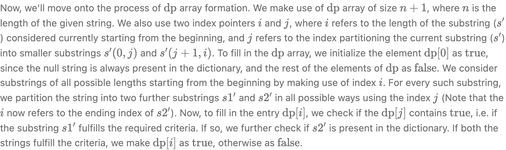

Solution
--------

`Algorithm`



- Time O(N^3)
- Space O(N)

```python
class Solution:
    def word_break(self, s: str, word_dict: list[str]) -> bool:
        word_set = set(word_dict)
        dp = [False] * (len(s) + 1)
        dp[0] = True

        for i in range(1, len(s) + 1):
            for j in range(i):
                if dp[j] and s[j:i] in word_set:
                    dp[i] = True
                    break
        return dp[len(s)]
```
